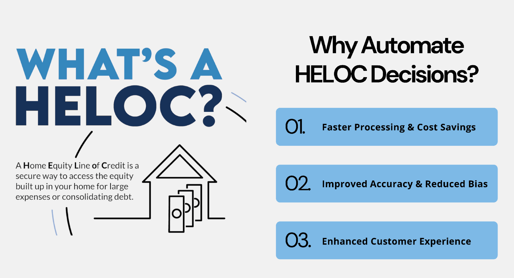

# HELOC Loan Approval Project

This project applies machine learning to support decision-making for **Home Equity Line of Credit (HELOC)** applications. The goal is to help banks reduce manual reviews, speed up processing, and provide applicants with clearer and more consistent feedback.

---

## Dataset and Preparation
The project is based on a dataset of historical HELOC applications, which includes a wide range of credit and risk attributes. Data preparation involved cleaning special missing codes, handling incomplete records, and correcting class imbalance using SMOTE. Feature selection combined statistical methods such as Lasso regression with domain knowledge to highlight the most predictive credit attributes.

---

## Modeling Approach
Several classification models were tested, including logistic regression, random forest, and XGBoost. After benchmarking, **XGBoost** achieved the strongest performance, with around **88% accuracy** and **84% recall**. This balance ensured the model could reliably identify potentially eligible borrowers while avoiding unfair denials.

The dataset contained ~10,000 historical HELOC applications with features describing credit history, delinquency patterns, external risk scores, and debt-to-income information. A separate data dictionary was used to decode variable meanings.  

**Data Cleaning & Feature Engineering:**  
- Replaced special codes (e.g., -7, -8, -9) with appropriate missing value treatments.  
- Dropped features with excessive missingness or low predictive value.  
- Applied standard scaling to continuous features where appropriate.  
- Balanced classes using **SMOTE** to reduce bias toward the majority class.  
- Performed **L1 (Lasso) regularization** for feature selection, retaining variables with the highest predictive signal.  

**Model Development:**  
- **Baseline:** Logistic Regression (transparent but limited in capturing non-linear effects).  
- **Random Forest:** Ensemble of decision trees with hyperparameter tuning; improved performance but moderate recall.  
- **XGBoost (Final Model):** Tuned learning rate, depth, and estimators; internally handled missing values and imbalances.  

**Performance Metrics:**  
- Accuracy: ~88%  
- Recall: ~84%  
- AUC-ROC: High (visualized in notebook with ROC/PR curves)  
- Confusion Matrix: Showed balanced performance with fewer false denials compared to other models.  

---

## Prototype Application
To make the model accessible, a lightweight **Streamlit app** was developed. The prototype allows users to enter loan application details and instantly receive a prediction of whether the application should be reviewed or denied. Alongside the prediction, the app provides easy-to-understand explanations, helping applicants see the reasons behind the outcome and what might improve their chances.

👉 **Try the live demo here:** [HELOC Loan Approval App](https://helocmodel-rdr85zcfv8wramvdgacjtx.streamlit.app/)

---

## Results and Impact
The final model, XGBoost, achieved strong performance with approximately 88% accuracy and 84% recall on held-out test data. This balance of accuracy and recall is significant because it ensures that the system not only makes correct predictions overall, but also captures the majority of applicants who should be considered for review. In a banking context, recall is especially important since denying an eligible customer could damage trust and result in lost business opportunities. By minimizing false denials while keeping precision reasonable, the model offers a practical balance that aligns with real-world needs.

Beyond model metrics, the project demonstrates meaningful business value. With automation, the time spent on initial manual reviews could be greatly reduced, which translates into lower operational costs and faster decision-making. The consistency of the model also reduces variability that often arises from human judgment, leading to more uniform and fair evaluations across applications. From a customer perspective, the ability to receive instant predictions with clear explanations enhances the overall experience by reducing uncertainty and providing actionable insights on how to improve eligibility in the future.

In addition, the prototype app illustrates how predictive models can move from theoretical analysis into user-facing tools that deliver immediate impact. By offering real-time feedback, banks can better manage workloads, applicants can make more informed decisions, and the overall lending process becomes more transparent and efficient.

---

## Technologies Used

| Category           | Tools / Packages                                | Purpose                                                                 |
|--------------------|-------------------------------------------------|-------------------------------------------------------------------------|
| Data Handling      | **pandas**, **numpy**                           | Data cleaning, transformation, and numerical operations                 |
| Machine Learning   | **scikit-learn**, **xgboost**, **imbalanced-learn (SMOTE)** | Model training, evaluation, feature selection, and class balancing      |
| Visualization      | **matplotlib**, **seaborn**                     | Creating charts, plots, and visual analysis of model performance        |
| Deployment & App   | **streamlit**, **ngrok** (testing), **shap**    | Building the interactive app, sharing demos, and providing explanations |
| Development Tools  | **Jupyter Notebook**, **Python 3.10+**          | Interactive coding, documentation, and environment setup                |
